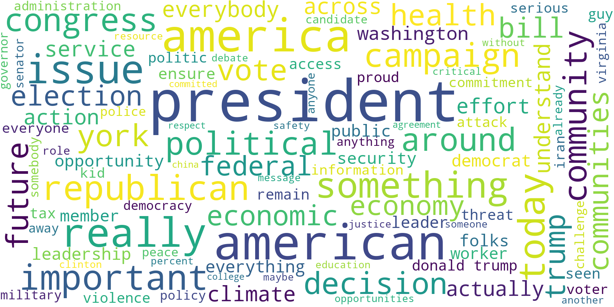

Political opinions have always been one of the most socially unifying or divisive topics, defining the people we surround ourselves with.  It has been strongly debated the extent to which contemporary political parties well represent each ideology and their internal and temporal coherence of opinions. What we will investigate in the following paragraphs is how such opinions and ideas can influence the way politicians speak, what they talk about, and the way they do it, with the ultimate aim of predicting the party of a politician just by hearing a bunch of words of his/hers, without any prior knowledge on the speaker. Is that possible? A machine learning classifier will try to answer this question.
## What and where: the two giants
Let’s start from the beginning. Since trying to answer the previous questions on a global scale would be too big of research for a single story, we decided to focus on what probably are the two most famous political parties in the world: USA’s Republican and Democratic parties. 

Even if you’re not living in the United States, you’re probably flooded by news about these two parties almost every day, wherever in the world you live. This is because the USA is one of the most powerful countries in the world and its electoral system is a two-party system. That means that two parties dominate the political field in all three levels of government, and those are exactly the Republican Party and the Democratic Party. Other parties, often generally termed “third parties”, in the U.S. include The Green Party, Libertarians, Constitution Party, and Natural Law Party, but we will not focus on them in this research.

In case you’re not fond of politics and you don’t know the difference between the two, here are some insights about them from Wikipedia.

The Republican Party, also referred to as the GOP ("Grand Old Party"), was founded in 1854. Its 21st-century ideology is American conservatism, which incorporates both social conservatism and fiscal conservatism. The GOP supports lower taxes, free-market capitalism, restrictions on immigration, increased military spending, gun rights, restrictions on abortion, deregulation, and restrictions on labor unions. In the 21st century, the demographic base skews toward men, people living in rural areas, members of the Silent Generation, and white Americans, particularly white evangelical Christians. Its most recent presidential nominee was Donald Trump.

The Democratic was founded around 1828. Its philosophy of modern liberalism blends notions of civil liberty and social equality with support for a mixed economy. Corporate governance reform, environmental protection, support for organized labor, expansion of social programs, affordable college tuition, health care reform, equal opportunity, and consumer protection form the core of the party's economic agenda. On social issues, it advocates campaign finance reform, LGBT rights, criminal justice, and immigration reform, stricter gun laws, abortion rights, the abolition of capital punishment, and the legalization of marijuana. The current president, Joe Biden, is a Democrat and right now this party is the largest in the United States and the third-largest in the world.

## How: the datasets that helped us with this data story
To learn meaningful insights about sentences from politicians we firstly needed the sentences. That’s where came into play the Quotebank dataset, an open corpus of 178 million quotations attributed to the speakers who uttered them, extracted from 162 million English news articles published between 2008 and 2020. From such a huge amount of data, we took quotes where the speaker's party was Republican or Democratic, filtering out speakers who have never run for any state or federal level election. The majority of the speakers affiliated with the political parties were not actual politicians, but celebrities, sports stars, TV personalities, etc. We believe it was beneficial to only take the actual politicians, as they are more likely to speak about actual political matters and represent their party's ideology. Finally, to relate each speaker to the correct party we also used a part of the Wikidata dataset.

The result of such filtering and processing was a “smaller” dataset of 1.6 million quotations.
## A deep dive into the data: what are the trending topics?
Previous to any deeper analysis, the most important thing we could do was to understand what the two parties talk about. What are the main problems, topics, trends, and events of the United States? How are they addressed by politicians? Let’s look, first, at the “big words”, those words that are always used and that you will most likely run into if you’re reading a sentence told by whatever politician.

  

    Democrats
    

  
  
Then, we might try to look for a difference between the two parties. We hence performed the same analysis but divided the quotes into two parts. The following clouds of words show the result.
  
  

(Dem and rep word clouds)

Identifying the most commonly used words is a good first step to understanding what do the politicians often talk about and we can already spot some differences between the two parties, but the results are a bit too fine-grained to draw meaningful conclusions from them. To overcome this issue, we want to identify the high-level concepts that are commonly discussed, and classify each quote into one of them. 

To achieve that, we first tried to use a transfer-learning approach: train a classifier on the data obtained from the Manifesto-Project dataset, which provides sentences of the two parties' manifestos over years 2012, 2016, and 2020, labeled manually by experts to one of fifteen different topics/categories. Unfortunately, the data was too different from ours and thus the resulting accuracy was not satisfying.

We then proceeded with unsupervised clustering using Bertopic, a topic modeling technique that leverages transformers and c-TF-IDF to create dense clusters allowing for easily interpretable topics whilst keeping important words in the topic descriptions. 
The following plot is a summary of the interesting results we obtained from clustering.

(stacked plot of topics)

The first thing worth noting from the stacked plot is the x-axis, reporting the macro-topics. Since this is the result of unsupervised clustering, those are the most frequent themes covered by representatives in their speeches. In the overall top 3, we have racial discrimination, nuclear weapons, and Russiagate.
What is much more interesting though is the difference in the most important talking points between the two parties. Democrats put racial discrimination in the first place, whereas Republicans talked more than everything else about Russiagate. Trying to explain why is that and what are the social reasons behind such differences is probably incredibly hard and out of the target of this data story. For this reason, we just try to explain the top topic of Democrats as superficial proof of the validity of our findings. Why racial discrimination is a major theme of discussion needs probably no explanation, especially given the 2020 events, but why Democrats talk more about it might be explained by this plot taken  from Pew Research Center’s research (https://www.pewresearch.org/politics/2017/10/05/4-race-immigration-and-discrimination/)

(second plot)

Such finding shows that Democrats are more willing to change things to give blacks equal rights with whites, therefore it makes sense that their politicians speak more about the problem.
(if someone can explain why it might make sense that republicans talked a lot more about Russia-gate, it would be great)

Let’s now see things more in detail, looking at the top 10 topics from the two parties during the years. 

(plots about  years top topics, when they’re ready)

… explanation of results, when we have them…

To conclude on this first part of the topic analysis, we tried to build a classifier that can predict the party of the speaker without knowing the quote itself but just looking at the theme covered in it. Just with that, we obtained a validation accuracy of 64%. By adding the year to the features given to the classifier, we then reached a 70.7% accuracy. Such a result might already give us a hint of the answer to the question in the title of this article. But let’s proceed with further analysis.

## How do Democrats and Republicans relate to national and international problems?

People say that how you relate to an obstacle has a big impact on how you try to solve the obstacle itself. Even though that’s often said about the individual’s way of solving problems, surely it’s important to see how political parties approach different problems to get a further understanding of the data we saw so far. For this reason, we applied two different sentiment analysis tools:
1. VADER-Sentiment library: a rule-based sentiment analysis tool
2. HuggingFace transformers library: a deep-learning-based NLP library providing access to several state-of-the-art models, often pre-trained on large datasets. In particular, we used RoBERTa, a model pre-trained specifically for the sentiment analysis task.
Both tools assign to a sentence a score between -1 and 1, where -1 means a highly negative sentiment, whereas +1 means a highly positive one. A score of 0 represents neutrality. Plotting the distribution of sentiment for the two tools we could see how VADER-sentiment had much more neutral sentences, as well as a positive average, compared to RoBERTa. 
(distribution common plot)
Despite the differences, there’s no substantial gap in the results, so we could proceed by addressing the first question: do the two parties use a different way of talking about topics, i.e. completely different emotions?
(distribution dem/rep sentiment plot  )
From the plots above, we can see that there’s not a huge difference in the sentiment Democrats and Republicans communicate with. There is, though, a statistically significant gap in the average, suggesting, with both tools, that Democrats are slightly more positive in their sentences. Another insight that might be more noticeable in RoBERTa’s plot is the fact that Republicans tend to have much more extremely sentimental quotes. 
From the famous “Psychologie des foules” by Gustave Le Bon we learned that mass communication performs better with emotions rather than logic. This is well known by politicians and, from our analysis, it seems like such an approach is used more by Republican ones.
Investigating for further details, we then looked for sentiments at the topic level. Before proceeding, we would like to clarify a possible misunderstanding of the results. If for example, we see a predominant negative sentiment over the topic of education, that doesn’t mean that politicians are against it, but rather that when they talk about it they usually have some criticism about it. To be more specific, if a speaker is complaining about the educational system and wants to suggest some improvements, he would probably use some negative sentiment in his/her words, but that wouldn’t mean that he/her is against education itself. Let’s now look at the results.
( topic sentiments plot - to be created (personally, I would consider only RoBERTa which has less neutral results or maybe joining the results, but two plots are too much stuff to look at for the reader))
What can we see? Firstly,  we can notice how negative sentiment exceeds the positive one: quotes are taken from news articles and news usually talk more about problems than positive events, just because they sell better. For this reason, we think that such results make sense. Then we observe how fake news and terrorism are in the top 3 most negative topics for both parties: obviously, it would have been hard to expect something else for terrorism, but it’s interesting to see it exceeded by fake news. Are they going to be one of the biggest threats in the future? 
Looking at the remarkable differences, we see how the guns’ topic is usually more criticized by Democrats. As stated before, this does not necessarily mean that Democrats are against guns, but in this making stricter rules on guns is part of their campaign so we can infer that, and other studies confirm it also about their supporters. (Key facts about Americans and guns | Pew Research Center)
(plot number 4 from the top in the link https://www.pewresearch.org/fact-tank/2021/09/13/key-facts-about-americans-and-guns/)

Other confirms of the correctness of results come from the fact that Democrats obviously used much more positive sentiment when they talked about Obama and now about Joe Biden, as well as Democratic Party in general (maybe Maciej add something about bias for certain topics that might explain negative average for Obama and Biden for democrats as well ? ). Other big gaps between the two parties can be found on Taxes and Communism, and in this case, results might be interesting, since Republicans want lower taxes, hence we expected more criticism on it (do you agree? What about communism? Idk what to say).

## What is the complexity and general understandability of the parties’ sentence?

The final aspect we decided to analyze is how the two different parties speak to their supporters. Since one of the pillars of rhetoric is that you should adapt your speech based on the people that will listen to it, and since politicians are probably the major users of this art (rhetoric), we thought that it would be really interesting to see the differences we can find on this regard. 

Let’s start with the different lexicon used. The first analysis we did was on the distribution of words length.

(plot with words’ length distribution)

As we can see the difference is almost none, but there’s a statistically significant difference between the two average lengths of words present in the vocabulary of quotes from Republican vs Democratic speakers (p-value of ~0.0). This might suggest slightly more complex words for Democratics, assuming that a longer word is also more complex. 

But we wanted to dive deeper by looking at the most common words that appeared just in Republicans’ quotes and vice versa. Subsequently, we also clustered the words obtained here into sets of synonyms. 

(the two word clouds and the clusters list)
(Help me on this one, idk what to write)

But a sentence is not just about the words in it, but how they’re put together as well. For this reason, we then moved our attention to some metrics that are used to measure the grammatical complexity of quotes:

1. Flesch reading ease: in the Flesch reading ease test, higher scores indicate material that is easier to read; lower numbers mark passages that are more difficult to read.
2. Dale Chall readability score: different from other tests, since it uses a lookup table of the most commonly used 3000 English words. It returns the grade level necessary to understand the sentence. Hence, the higher the score, the higher is the difficulty.
3. Text Standard: based upon a combination of all the library's tests, returns the estimated school grade level required to understand the text.
4. Reading time: returns the reading time of the given text. Assumes 14.69ms per character.

(plots with metrics)

From the results shown above we can see a clear (and statistically significant) difference between the scores in all metrics, but before drawing any conclusion, let’s repeat the analysis on just the quotes from the two most important men from the two parties: Barack Obama and Donald Trump.

(plots with metrics) 

Again, the plots show consistent results with the previous ones, considering all speakers from both parties. The last thing we can do is if we can observe any difference through the years.

(Plot with years)

The result is stable across years and metrics, and it seems to suggest just one thing: there’s a substantial difference in the complexity and readability of quotes from the two parties and usually, Republican ones are easier to understand, as well as faster to read, even though reading time shows the smallest gap of the four metrics. Does this outcome make sense? Many articles covered this topic and what turned out to be clear in all of them is that Republicans and Democrats have become more and more polarized, with completely different opinions and languages ( Why Democrats and Republicans Speak Different Languages. LIterally. - The Atlantic , Opinion | Democrats and Republicans No Longer Speak the Same Language - The New York Times (nytimes.com), Why Democrats and Republicans Use Different Words (businessinsider.com)).  Considering all this, we should probably have not expected anything else but a significant gap. Why though Democrats use more complex sentences? Getting back to the rhetoric principle that a speaker adapts to his supporters, does this suggest that Republicans’  defenders are less literate? Accordingly to this plot and this research from Pew Research Center, yes (Ideological Gap Widens Between More, Less Educated Adults | Pew Research Center). 

Subsequently, we used the scores to train another party classifier. The accuracy we obtained was 0.59, which shows that those complexity metrics do have actual predictive power over the party choice.

## Pulling all together: creating the final party classifier.
Coming soon.

