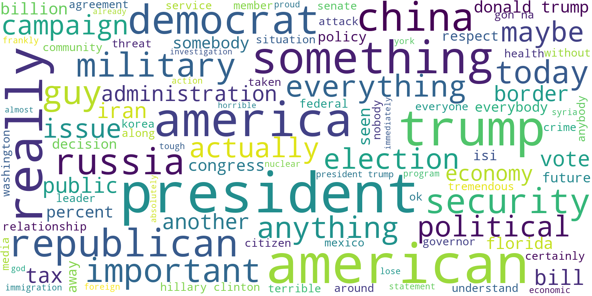

## Abstract

Political opinions can be one of the most socially unifying or divisive topics, defining the people we surround ourselves with. It has been strongly debated the extent to which contemporary political parties well represent each ideology and their internal and temporal coherence of opinions. What we plan to investigate in the following project is how such opinions and ideas can influence the way politicians speak, what they talk about, and the way they do it.

Starting from quotes of US representatives of the Democratic and Republican parties, we divide them by treated subject and perform sentiment analysis on them across time, to assess the evolution of opinions of the two groups on different matters. Pairing these results with an analysis of the lexical and syntactical properties of the sentences, we try to build a model capable of predicting the affiliations of the speaker based on his quotes.

## Data preprocessing

To perform the analysis, we are interested in selecting only the quotes from politicians and matching them with the political affiliation of the speaker. To obtain a dataset of US Politician quotations, we proceed to:

1. Only keep the quotations where the speaker's party is Republican or Democratic.
2. Filter out speakers who have never run for any state or federal level election - the majority of the speakers affiliated with the political parties were not actual politicians - they are often celebrities, sports stars, TV personalities, etc. We believe it is beneficial to only take the actual politicians, as they are more likely to speak about actual political matters and represent their party's ideology.

Performing step 1 reduces the size of the dataset from 17 million rows to around 8 million rows, and step 2 reduces the size further to around 1.6 million.

## Area 1: Topic labeling

### Word clouds
We first tried to see which are the most frequently used words in the quotation dataset. After filtering and preprocessing the words to remove commonly used words of the English language which don't provide us any additional information as to what topics are being talked about in the quotes. We ended up with a sample as such.

Commonly used words in quotes from:

  

    Democrats
    
  

  

    Republicans
    
  

Identifying the most commonly used words is a good first step to understanding what do the politicians often talk about, but the results are a bit too fine-grained to draw meaningful conclusions from them.

To overcome this issue, we want to identify the high level concepts/topics that are commonly discussed, and classify each quote to one of the topics.

### Clustering

We used unsupervised clustering, using transformers and c-TF-IDF through Berttopic, to create dense clusters of our filtered words. We ended up with around 900 clusters and with some manual post-processing we narrowed down to 20 or so well-defined and labelled clusters.

TODO: visualize initial topics

### Area 2: Sentiment analysis

1. Is there a difference between the fraction of quotations that are positive/negative between the two parties? What does that say about the general attitude of the party?
2. What are there topics towards which the parties have very different sentiments? Does this align with the parties' ideology?
3. Are there cases of a party changing completely its attitude towards a specific topic?

#### Method:

Labeling the quotations as positive/negative, often referred to as sentiment analysis, introduces additional information about the emotion that is carried by the quotation. Attributing sentiment to quotations can be performed using pre-trained transformer models such as [BERT](https://arxiv.org/abs/1810.04805). The sentiment can be then computed per party/topic and the time evolution can also be analyzed.

### Area 3: Grammatical structure and complexity

1. Do speakers of the two groups use a different lexicon? Which one uses the largest vocabulary?
2. Is there any noticeable difference in the complexity of the sentences? Which one is more readable?
3. How did the grammar complexity and correctness of sentences evolve with time?

#### Method:

Utilizing the `Textstat` library we added to each quotes different readability, complexity, and grade level metrics. Thanks to these statistics we might see if there's a significant difference between speakers from different parties, as well as differences between people with identical affiliations but different backgrounds. Some analysis has already been performed, please see `exploratory_analysis.ipynb`.

### Area 4: Predicting speaker's political affiliation

1. Combining all the data from the preprocessing, enriched by sentiment analysis, topic classification, and grammatical complexity, is it possible to build a classifier that can predict whether the quoted speaker is affiliated with Republicans or Democrats?

#### Method:

Build a classifier using a transfer learning approach. Utilize a pre-trained model (most likely BERT-based) for feature extraction, fine-tune it for the classification task. Evaluate performance on a test set.

## Internal Milestones & Timeline

A high-level timeline of the planned project execution:

#### Week of 26.11 - 3.12

In the first week we plan to:

- explore the topics covered in the quotations:
  - explore the terms commonly used in the quotations
  - train a classifier for topic labeling
- perform sentiment analysis on the quotes, explore
  - the sentiment the parties have towards certain topics
  - the time evolution of the sentiment
- make use of the `Textstat` library to examine the grammar and complexity of the sentences

#### Week of 3.12 - 12.12

In the second week we will:

- start drawing conclusions based on the results obtained in the previous week
- train the final classifier for predicting the speaker's party based on the content of the quotation

#### Week of 10.12 - 12.12

In the final week we aim to:

- analyze the results of the classifier
- polish/perfect the graphs and the overall analysis
- focus on writing an attractive data story based on our results

We aim to follow an agile, sprint-based development workflow, therefore more precise internal milestones will be decided week by week, as the project progresses.

### Authors

- Maciej Styczeń - maciej.styczen@epfl.ch
- Nicolo de Sabbata - camillo.desabbata@epfl.ch
- Dixit Sabharwal - dixit.sabharwal@epfl.ch
- Elia Fantini - elia.fantini@epfl.ch
