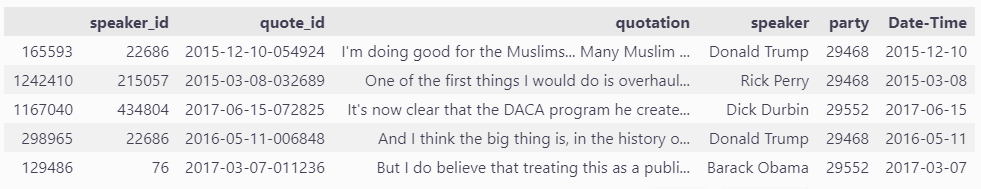
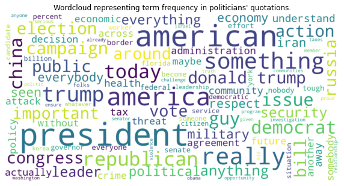

## Abstract

Political opinions can be one of the most socially unifying or divisive topics, defining the people we surround ourselves with. It has been strongly debated the extent to which contemporary political parties well represent each ideology and their internal and temporal coherence of opinions. What we plan to investigate in the following project is how such opinions and ideas can influence the way politicians speak, what they talk about, and the way they do it.

Starting from quotes of US representatives of the Democratic and Republican parties, we divide them by treated subject and perform sentiment analysis on them across time, to assess the evolution of opinions of the two groups on different matters. Pairing these results with an analysis of the lexical and syntactical properties of the sentences, we try to build a model capable of predicting the affiliations of the speaker based on his quotes.

## Data preprocessing

To perform the analysis, we are interested in selecting only the quotes from politicians and matching them with the political affiliation of the speaker.
To obtain such a dataset, we perform the following preprocessing steps:

1. Load the Quotebank dataset.
2. Drop the quotes without an attributed speaker.
3. Load the Wikidata table with metadata about the speakers and select the speakers that are affiliated with the Democratic or Republican party.
4. Perform an inner join between the table containing the quotes (Quotebank) and the table containing (Wikidata).
5. Select the subset of the data that corresponds to politicians affiliated with Democrats and Republicans that were candidates in at least one election.

In addition, we plan to use grammatical structure and complexity metrics to analyze quotes and drop the ones with outlier values, as they are likely to be meaningless quotes.

After preprocessing we have a dataset of 1.6m quotations of US politicians, associating each quote to the speaker who uttered it and his political affiliation - see an example below:

Please consult `preprocessing.ipynb` for the code and a more extensive explanation of the preprocessing steps.

## Research questions

### Area 1: Topic labeling

1. What terms/phrases characteristic of politics appear most often in the quotations? Is there a difference between the terms used by the two parties?
2. Can a classifier be constructed to automatically classify quotations to groups corresponding to topics (e.g. economy, military, environment)?
3. How do the popular topics differ between the two parties? Can the popular topics be linked to the ideologies linked to the speaker's party?
4. How does the topic's popularity evolve with time?

**Note**: Questions 3 and 4 can only be answered if we can successfully assign topics to quotations.

#### Method:

To get an initial understanding of what topics do politicians often mention, we performed a word frequency analysis (see `frequency_analysis.ipynb`). The results are visualized in the figure below:

Additionally, we used the [Manifesto-Project dataset](https://manifestoproject.wzb.eu), which provides sentences of the two parties' manifestos over years 2012, 2016, and 2020, labeled manually by experts to one of fifteen different topics/categories. Using this data we aim to train an ML model that depends on keyword frequency analysis, the model is trained on the distribution of these keywords in the labeled Manifesto-Project dataset and then used to classify the quotes into the same categories.

### Area 2: Sentiment analysis

1. Is there a difference between the fraction of quotations that are positive/negative between the two parties? What does that say about the general attitude of the party?
2. What are there topics towards which the parties have very different sentiments? Does this align with the parties' ideology?
3. Are there cases of a party changing completely its attitude towards a specific topic?

#### Method:

Labeling the quotations as positive/negative, often referred to as sentiment analysis, introduces additional information about the emotion that is carried by the quotation. Attributing sentiment to quotations can be performed using pre-trained transformer models such as [BERT](https://arxiv.org/abs/1810.04805). The sentiment can be then computed per party/topic and the time evolution can also be analyzed.

### Area 3: Grammatical structure and complexity

1. Do speakers of the two groups use a different lexicon? Which one uses the largest vocabulary?
2. Is there any noticeable difference in the complexity of the sentences? Which one is more readable?
3. How did the grammar complexity and correctness of sentences evolve with time?

#### Method:

Utilizing the `Textstat` library we added to each quotes different readability, complexity, and grade level metrics. Thanks to these statistics we might see if there's a significant difference between speakers from different parties, as well as differences between people with identical affiliations but different backgrounds. Some analysis has already been performed, please see `exploratory_analysis.ipynb`.

### Area 4: Predicting speaker's political affiliation

1. Combining all the data from the preprocessing, enriched by sentiment analysis, topic classification, and grammatical complexity, is it possible to build a classifier that can predict whether the quoted speaker is affiliated with Republicans or Democrats?

#### Method:

Build a classifier using a transfer learning approach. Utilize a pre-trained model (most likely BERT-based) for feature extraction, fine-tune it for the classification task. Evaluate performance on a test set.

## Internal Milestones & Timeline

A high-level timeline of the planned project execution:

#### Week of 26.11 - 3.12

In the first week we plan to:

- explore the topics covered in the quotations:
  - explore the terms commonly used in the quotations
  - train a classifier for topic labeling
- perform sentiment analysis on the quotes, explore
  - the sentiment the parties have towards certain topics
  - the time evolution of the sentiment
- make use of the `Textstat` library to examine the grammar and complexity of the sentences

#### Week of 3.12 - 12.12

In the second week we will:

- start drawing conclusions based on the results obtained in the previous week
- train the final classifier for predicting the speaker's party based on the content of the quotation

#### Week of 10.12 - 12.12

In the final week we aim to:

- analyze the results of the classifier
- polish/perfect the graphs and the overall analysis
- focus on writing an attractive data story based on our results

We aim to follow an agile, sprint-based development workflow, therefore more precise internal milestones will be decided week by week, as the project progresses.

### Authors

- Maciej Styczeń - maciej.styczen@epfl.ch
- Nicolo de Sabbata - camillo.desabbata@epfl.ch
- Dixit Sabharwal - dixit.sabharwal@epfl.ch
- Elia Fantini - elia.fantini@epfl.ch
